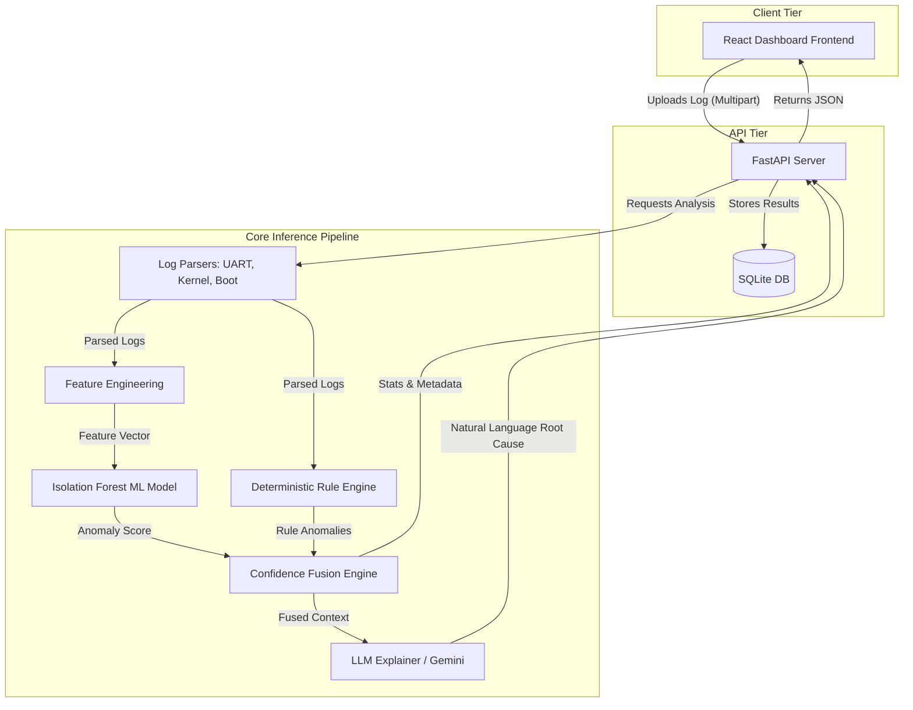
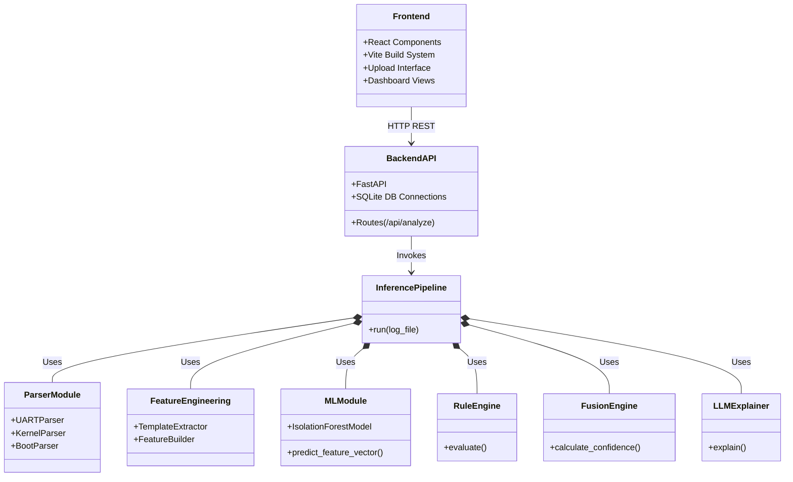
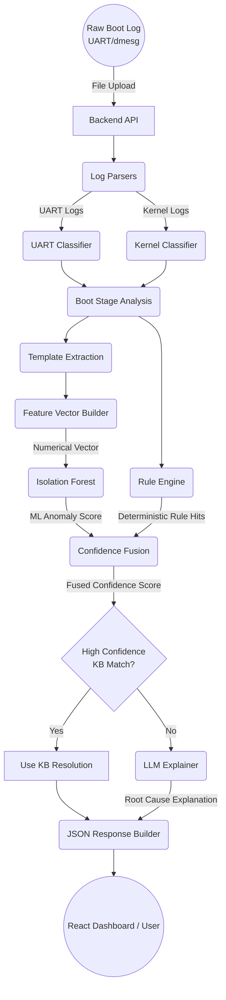
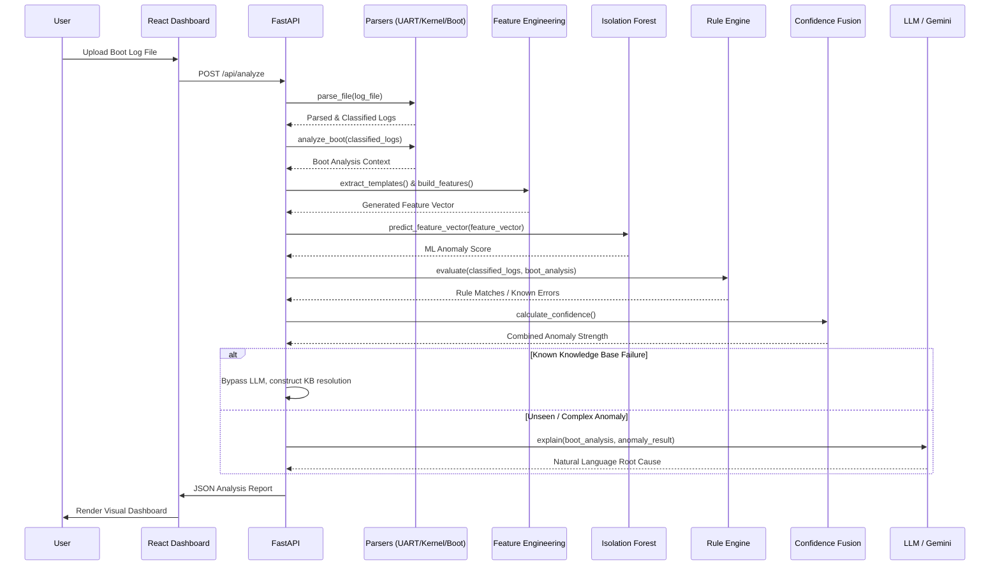

# System Architecture and Design Document

This document outlines the system architecture, data flow, and sequence of operations for the **AI-Based Boot Firmware and OS Boot Log Analytics** project.

## 1. System Design Architecture

The system follows a modular, decoupled architecture consisting of a React-based frontend, a FastAPI backend, and an intensive ML/Analytics core pipeline.

## 2. System Architecture (Component View)

## 3. Data Flow Diagram (DFD)

The following diagram illustrates how raw text log data is transformed into numerical features, scored for anomalies, and finally converted into plain-english insights.

## 4. Sequence Diagram

This sequence diagram depicts the chronological execution flow when a user uploads a log file for analysis.

