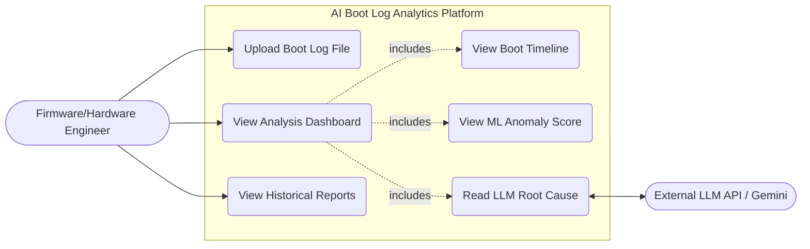
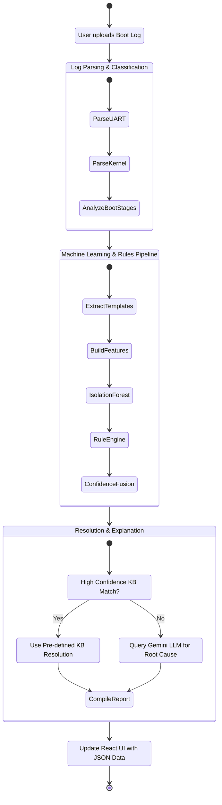
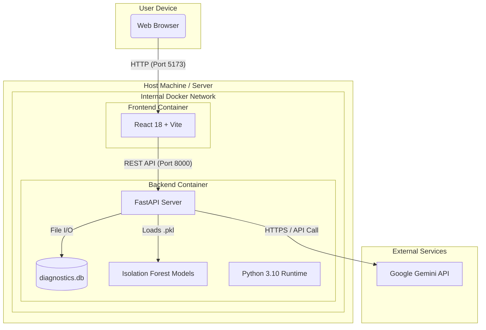

# UML Diagrams (Part 2)

This document contains the **Use Case Diagram**, **Activity Diagram**, and **Deployment Diagram** for the **AI-Based Boot Firmware and OS Boot Log Analytics** project.

## 1. Use Case Diagram

This diagram illustrates the interactions between the users (e.g., Firmware/Hardware Engineers) and the various features of the system.

```mermaid
usecaseDiagram
    actor "Firmware/Hardware Engineer" as User
    
    rectangle "AI Boot Log Analytics Platform" {
        usecase "Upload Boot Log File" as UC1
        usecase "View Analysis Dashboard" as UC2
        usecase "View Boot Timeline & Milestones" as UC3
        usecase "View ML Anomaly Score" as UC4
        usecase "Read LLM Root Cause Explanation" as UC5
        usecase "View Historical Boot Data" as UC6
    }
    
    User --> UC1
    User --> UC2
    User --> UC6
    
    UC2 ..> UC3 : <<includes>>
    UC2 ..> UC4 : <<includes>>
    UC2 ..> UC5 : <<includes>>
    
    actor "External LLM API (Gemini)" as Gemini
    UC5 <-- Gemini : Provides Explanation
```

*(Note: If the `usecaseDiagram` syntax is not fully supported by all standard markdown viewers, a flowchart representation of the Use Case is provided below for maximum compatibility.)*




## 2. Activity Diagram

This diagram shows the step-by-step workflow of the system from the moment a log file is uploaded until the dashboard is presented.



## 3. Deployment Diagram

This diagram maps the software components to the physical/virtual hardware nodes they run on, based on the `docker-compose.yml` and project structure.


